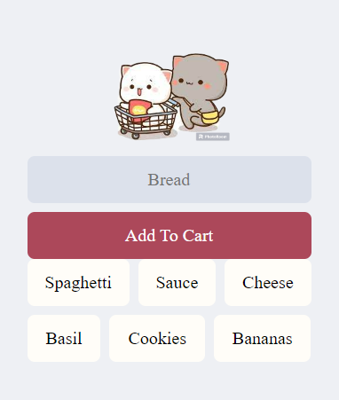

# add-to-cart
shopping list progressive web app using html, css, js, and firebase

## Description
This is a PWA(Progressive Web App) that was designed to solve simple daily problems in our lives like creating a shopping list at
the grocery store using HTML, CSS, Javascript and Firebase Database. Firebase will allow users to use a realtime database to store the
app's data. 

https://kevinng2.github.io/add-to-cart/

## Usage
Setting up Firebase Realtime Database, hook it up to your project, add data to the database, pull the data from the database in realtime,
display it in your app, and finally, delete the data from the database.

## Credits
Kevin Ng

## Contact
-Github: [KevinNg2](https://github.com/KevinNg2)

-Email: [kevinng3292@gmail.com](mailto:kevinng3292@gmail.com)
